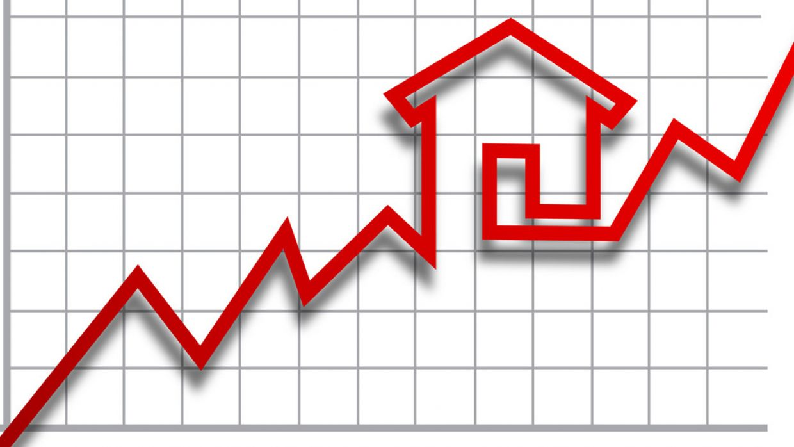
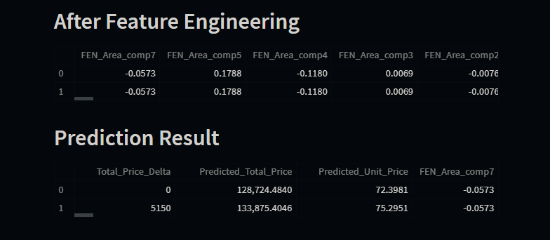
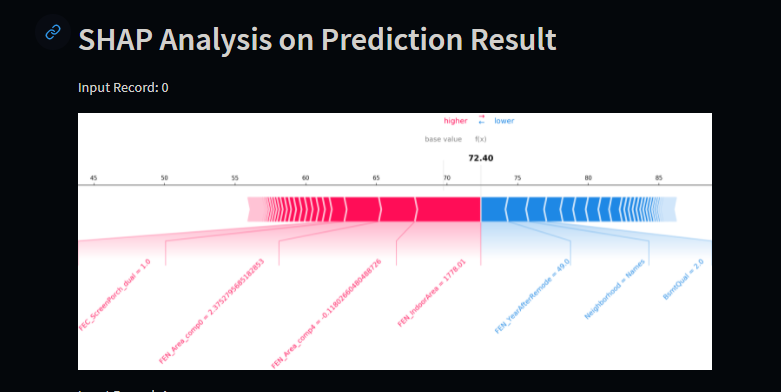

# Housing Prices Modeling Analysis

This repo contains the data, modeling, data dashboard, and an interactive platform to analyze the features that affect housing prices in Ames, Iowa.

The dataset and project was derived from a [Kaggle](https://www.kaggle.com/c/house-prices-advanced-regression-techniques) competition that provides data that describes different feature aspects of homes in Ames, Iowa to be able to develop a predictive model.

---
### **Directory Layout**

    |   README.md
    |
    +---dashboard                               # model analysis dashboard
    |   |   index.py
    |   |
    |   +---assets
    |   |   |
    |   |   +---imgs
    |   |
    |   +---pages
    |
    +---data                                    # housing prices data
    |
    +---images                                  
    |
    +---notebook                                # jupyter notebooks
    |
    \---streamlit                               # interactive platform
        |   main.py
        |   README.md
        |   requirements.txt
        |   temp.csv
        |
        +---010_data
        +---image
        +---model

**dashboard** - Dash dashboard for presenting the data, feature engineering, the steps we took to prepare the models, and the final model results.

**data** - All of the data files used in the Jupiter notebook. The original dataset from Kaggle contains 79 explanatory variables describing nearly every aspect of residential homes in Ames, Iowa. We took it a step further and expanded the number of variables from 79 to 140+ variables. 

**notebook** - Jupyter notebooks for our baseline models, feature extraction, final models and also saved models

**streamlit** - An interactive platform to test our model and get your home price prediction. You can mess around with different values for each of the features to see what our model predicts the housing price will be. Furthermore, you can analyze how different features of the home affect one another when one is changed in the SHAP analysis. 

---
### **Tools**
- Dash 

- Streamlit 

---
### **Algorithms**
- Random Forest (RF)
- k-Nearest-Neighbors (kNN)
- eXtreme Gradient Boosting (XGB)
- Catboost
- Shap
- Optuna

---
### **Python Dash Data Analysis Dashboard**

---
### **Streamlit Interactive Platform**

---
### **Contributors**

*This project was created for a Applied Machine Learning project at UC Berkeley in Fall, 2021*

* Lynn Marciano
* Wanyu Li
* Jason Cheung

---
### References
1. Data dictionary and raw data - https://www.kaggle.com/c/house-prices-advanced-regression-techniques/data
2. Missing Values, Ordinal data and stories - https://www.kaggle.com/mitramir5/missing-values-ordinal-data-and-stories/notebook
3. House Price Feature Engineering using only XGB - https://www.kaggle.com/filterjoe/house-price-feature-engineering-using-only-xgboost#Step-2---Feature-Utility-Scores
